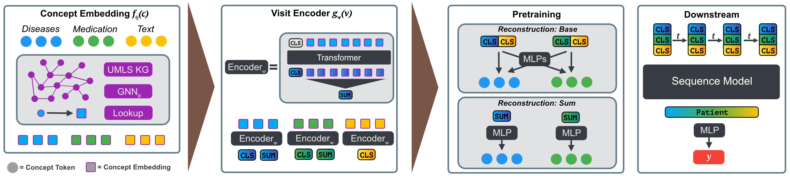

# Multi-modal Graph Learning over UMLS Knowledge Graphs

This is the code repository for MMUGL: *Multi-Modal UMLS Graph Learning*. The following sections will guide you through the repositories contents.

Paper: https://proceedings.mlr.press/v225/burger23a.html



## Demo

You can find a demo showing some of the models predictions here: [https://mmugl.dnsalias.org](https://mmugl.dnsalias.org).

## Setup

We use a `conda` environment to manage our dependencies. We provide an export of the environment used during development at `conda_linux_x86_environment.yml`. Please note that if you run on a different architecture or platform you might have to modify the file to reach a successfull installation.

You can create the environment by:
```
conda env create -f conda_linux_x86_environment.yml
```

We recommend to use [mamba](https://mamba.readthedocs.io/en/latest/installation.html)
```
mamba env create -f conda_linux_x86_environment.yml
```

Then activate the environment and install the package with the custom code called `kg` (shorthand for *Knowledge Graph*):
```
conda activate mmugl
pip install -e ./kg
```

### QuickUMLS

Please setup *QuickUMLS* as instructed in their [GitHub repository](https://github.com/Georgetown-IR-Lab/QuickUMLS). You will require an installation
of UMLS for this; please see below in the data section.

As per the QuickUMLS GitHub issue [here](https://github.com/Georgetown-IR-Lab/QuickUMLS/issues/68) please adapt
the shorthand `en` in your QuickUMLS installation file: `constants.py` to `en_core_web_sm`.


## Data

### MIMIC-III

You can request access for MIMIC-III on the [Physionet](https://physionet.org/content/mimiciii/1.4/) website; you need a credentialed user account on Physionet to be able to access the dataset. The main project page can be found [here](https://mimic.mit.edu). An open access demo version can be found [here](https://physionet.org/content/mimiciii-demo/1.4/). The files we are mostly interested in are:

- ADMISSIONS.csv
- DIAGNOSES_ICD.csv
- PRESCRIPTIONS.csv
- NOTEEVENTS.csv

### UMLS

You can access [UMLS](https://www.nlm.nih.gov/research/umls/index.html) by creating an account and requesting a license as instructed [here](https://www.nlm.nih.gov/databases/umls.html).
The files we are mostly interested in are:

- MRCONSO.RRF
- MRDEF.RRF
- MRHIER.RRF
- MRREL.RRF
- MRSAT.RRF
- MRSTY.RRF

### G-BERT

You can get the respective preprocessed data and required files for mapping prescription codes from the [G-Bert GitHub repository](https://github.com/jshang123/G-Bert); the mapping files used by Shang et al.
in G-BERT are provided in the [GAMENet](https://github.com/sjy1203/GAMENet/tree/master/data) repository. We need the files: `ndc2atc_level4.csv` and `ndc2rxnorm_mapping.txt`.
We suggest to create a directory in `./data` called `code_mappings`:

```
> tree ./data
├── cgl_mimic3_disease_codes.txt
├── cgl_patient_splits.pkl
├── code_mappings
│   ├── ndc2atc_level4.csv
│   └── ndc2rxnorm_mapping.txt
├── disease_codes_all.txt
└── med_codes_all.txt
```

## Preprocessing

Most of the preprocessing is done on-the fly in the main training script. However, we need to extract the set
of relevant medical concepts from the clinical reports in MIMIC-III and build the used graph over the concepts
beforehand.

### Medical Concept Extraction

To extract the set of relevant medical concepts for each patient the script `text_concept_extraction.py` in `./dev` should be used:
```
python text_concept_extraction.py \
    --output $PROJECT/data \
    --name base \
    --workers 4 \
    --mimic_path $PATH_TO_MIMIC_DATA \
    --quickumls_path $PATH_TO_QUICKUMLS_INSTALLATION \
    --window 6 \
    --threshold 0.9 \
    --similarity jaccard
```
This should create a file in `$PROJECT/data` with a name similar to `noteevents_base_jaccard_0.9_w6.pkl`.

### UMLS Knowledge Graph

The extracted knowledge graph is based on the medical concepts extracted from the dataset. The script
`umls_graph_extraction.py` in `./dev` is used to create the graph:
```
python umls_graph_extraction.py \
    --output $PROJECT/data/umls_graph.pkl \
    --workers 4 \
    --text_concepts $PROJECT/data/noteevents_base_jaccard_0.9_w6.pkl \
    --use_categories \
    --icd_codes $PROJECT/data/disease_codes_all.txt \
    --atc_codes $PROJECT/data/med_codes_all.txt \
    --build_code_trees \
    --umls_path $PATH_TO_UMLS_DATA \
    --grow_hops 0 \
    --reduce_vocabularies \
    --add_sab \
    --add_sapbert
```
This should store the extracted graph as a `networkx` object in `$PROJECT/data/umls_graph.pkl`.

## Training

For training we use the script `run_training_concepts.py` in `./dev`. There are many options and hyperparameters. A recommended configuration can be found `/dev/examples`.

You can run training for a diagnosis downstream task by copying the example `diagnosis_training_example.sh` to the `./dev` directory, editing
the shell variables at the top of the script with the right paths
 and then running the following command. Pretraining is performed
 within the same script ensure the flag `--pretrain` is set. All
 of the following examples train *MMUGL* as referred to
 in our paper (including medical concepts from text i.e. clinical reports).

```
bash diagnosis_training_example.sh
```

To train a heart failure downstream task:

```
bash heart_failure_training_example.sh
```

To train the medication recommendation task please ensure you have downloaded the
preprocessed data from the [G-Bert GitHub repository](https://github.com/jshang123/G-Bert) into `./data/gbert`.
You should have a `./data` directory that looks like this:

```
> tree ./data
├── cgl_mimic3_disease_codes.txt
├── cgl_patient_splits.pkl
├── code_mappings
│   ├── ndc2atc_level4.csv
│   └── ndc2rxnorm_mapping.txt
├── disease_codes_all.txt
├── gbert
│   ├── README.md
│   ├── data-multi-visit.pkl
│   ├── data-single-visit.pkl
│   ├── dx-vocab-multi.txt
│   ├── dx-vocab.txt
│   ├── eval-id.txt
│   ├── px-vocab-multi.txt
│   ├── rx-vocab-multi.txt
│   ├── rx-vocab.txt
│   ├── test-id.txt
│   └── train-id.txt
└── med_codes_all.txt
```

then you can adjust the path at the top of the example shell script and run:

```
bash medication_training_example.sh
```

## Citation

```bibtex
@InProceedings{pmlr-v225-burger23a,
  title = 	 {Multi-modal Graph Learning over UMLS Knowledge Graphs},
  author =       {Burger, Manuel and R\"atsch, Gunnar and Kuznetsova, Rita},
  booktitle = 	 {Proceedings of the 3rd Machine Learning for Health Symposium},
  pages = 	 {52--81},
  year = 	 {2023},
  editor = 	 {Hegselmann, Stefan and Parziale, Antonio and Shanmugam, Divya and Tang, Shengpu and Asiedu, Mercy Nyamewaa and Chang, Serina and Hartvigsen, Tom and Singh, Harvineet},
  volume = 	 {225},
  series = 	 {Proceedings of Machine Learning Research},
  month = 	 {10 Dec},
  publisher =    {PMLR},
  pdf = 	 {https://proceedings.mlr.press/v225/burger23a/burger23a.pdf},
  url = 	 {https://proceedings.mlr.press/v225/burger23a.html}
}
```
